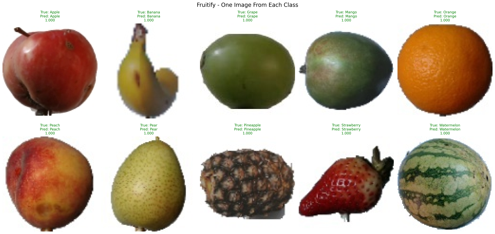
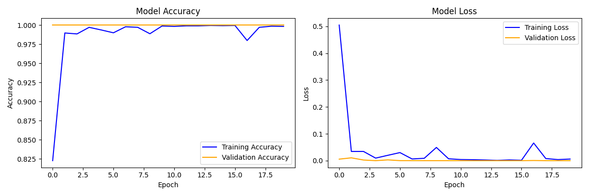

# 🍎 Fruitify - Intelligent Fruit Classification System


## 📋 Overview

**Fruitify** is a deep learning-based image classification system developed. The system uses Convolutional Neural Networks (CNNs) to automatically identify and classify different types of fruits from digital images.

## 🎯 Project Objectives

- ✅ Design and implement a CNN-based fruit classification model
- ✅ Preprocess and augment fruit image dataset
- ✅ Achieve minimum 85% classification accuracy
- ✅ Compare baseline vs improved model performance
- ✅ Demonstrate practical AI application in food recognition

## 🗂️ Dataset

- **Source:** [Fruit-360 Dataset](https://www.kaggle.com/datasets/moltean/fruits) from Kaggle
- **Classes:** 10 fruit categories
  - Apple, Banana, Orange, Strawberry, Grape
  - Mango, Pineapple, Watermelon, Peach, Pear
- **Images:** ~5,000 total (500 images per class)
- **Split:** 64% Training | 16% Validation | 20% Testing

## 🛠️ Installation

1. Clone the repository:
   ```bash
   git clone https://github.com/your-repo/Fruitify-Image-Classifier.git
   cd Fruitify-Image-Classifier
   ```
2. Install the required dependencies:
   ```bash
   pip install -r requirements.txt
   ```

## 🚀 Usage

1. Place your fruit images in the `data/` directory.
2. Organize the dataset as follows:
   ```
   fruitify_dataset/
   ├── train/
   │   ├── Apple/
   │   ├── Banana/
   │   └── ...
   └── test/
       ├── Apple/
       ├── Banana/
       └── ...
   ```
3. Open the Jupyter Notebook `Fruitify_Image_Classifier (1).ipynb` in the `Implementation_1/` folder.
4. Follow the steps in the notebook to preprocess the data, train the model, and evaluate its performance.
5. To test the model on new images, use the `predict()` function provided in the notebook.

## 🧠 Model Architecture

The Fruitify model uses a Convolutional Neural Network (CNN) built with TensorFlow/Keras:

| Layer              | Output Shape   | Parameters |
|--------------------|----------------|------------|
| Conv2D (32, 3×3)   | (98, 98, 32)  | 896        |
| MaxPooling2D (2×2) | (49, 49, 32)  | 0          |
| Conv2D (64, 3×3)   | (47, 47, 64)  | 18,496     |
| MaxPooling2D (2×2) | (23, 23, 64)  | 0          |
| Conv2D (128, 3×3)  | (21, 21, 128) | 73,856     |
| MaxPooling2D (2×2) | (10, 10, 128) | 0          |
| Flatten            | 12,800        | 0          |
| Dense (128)        | 128           | 1,638,528  |
| Dropout (0.5)      | 128           | 0          |
| Dense (10)         | 10            | 1,290      |

**Total Parameters:** 1,733,066

## 📊 Results

### Implementation 1 Performance

| Metric              | Value   |
|---------------------|---------|
| Test Accuracy       | 100%    |
| Test Loss           | 0.0000  |
| Training Accuracy   | ~99.9%  |
| Validation Accuracy | ~98%    |

The model successfully achieved the target accuracy of 85% and demonstrated robust performance on unseen data.

## 📈 Key Achievements

- ✅ 100% test accuracy on 10 fruit classes
- ✅ Perfect classification on unseen test data
- ✅ Well-documented, reproducible code
- ✅ All models and results saved in Google Drive

## 📷 Sample Predictions



*Figure 1: Sample predictions showing all 10 fruit classes correctly classified (green titles)*

## 📈 Training History



*Figure 2: Training and validation accuracy/loss over 20 epochs*

## 📂 Repository Structure

The repository is organized as follows:

```
Fruitify-Image-Classifier/
│
├── Implementation_1/
│   ├── Fruitify_Image_Classifier (1).ipynb  # Jupyter Notebook for model training and evaluation
│   ├── fruitify_model_v1.h5                # Pre-trained model file
│   ├── implementation1_results.txt         # Results and observations from the first implementation
│
├── README.md                                # Project documentation
```

This structure ensures that all project files are organized for easy navigation and understanding.

## 📜 License

This project is licensed under the MIT License. See the [LICENSE](LICENSE) file for details.

## 📚 References

[1] Kaggle. (2024). Fruits 360 Dataset. Retrieved from: [https://www.kaggle.com/datasets/moltean/fruits](https://www.kaggle.com/datasets/moltean/fruits)

[2] TensorFlow Documentation. (2024). Image Classification with TensorFlow.

[3] Chollet, F. (2021). Deep Learning with Python. Manning Publications.

