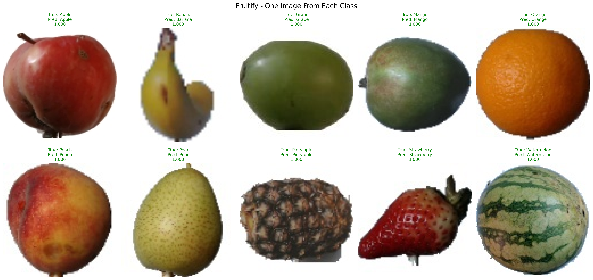
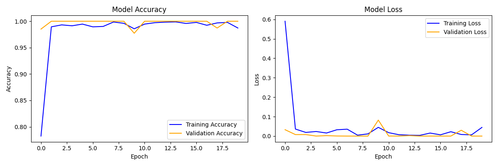

# 🍎 Fruitify - Intelligent Fruit Classification System


## 📋 Overview

**Fruitify** is a deep learning-based image classification system developed. The system uses Convolutional Neural Networks (CNNs) to automatically identify and classify different types of fruits from digital images.

## 🎯 Project Objectives

- ✅ Design and implement a CNN-based fruit classification model
- ✅ Preprocess and augment fruit image dataset
- ✅ Achieve minimum 85% classification accuracy
- ✅ Compare baseline vs improved model performance
- ✅ Demonstrate practical AI application in food recognition

## 🗂️ Dataset

- **Source:** [Fruit-360 Dataset](https://www.kaggle.com/datasets/moltean/fruits) from Kaggle
- **Classes:** 10 fruit categories
  - Apple, Banana, Orange, Strawberry, Grape
  - Mango, Pineapple, Watermelon, Peach, Pear
- **Images:** ~6761 total 
- **Split:** 60% Training | 15% Validation | 25% Testing

## 🛠️ Installation

1. Clone the repository:
   ```bash
   git clone https://github.com/your-repo/Fruitify-Image-Classifier.git
   cd Fruitify-Image-Classifier
   ```
2. Install the required dependencies:
   ```bash
   pip install -r requirements.txt
   ```

## 🚀 Usage

1. Place your fruit images in the `data/` directory.
2. Open the Jupyter Notebook `Fruitify_Image_Classifier (1).ipynb` in the `Implementation_1/` folder or `Fruitify_Image_Classifier (4).ipynb` in the `Implementation_2/` folder.
3. Follow the steps in the notebook to preprocess the data, train the model, and evaluate its performance.
4. To test the model on new images, use the `predict()` function provided in the notebook.

## 🧠 Model Architecture

The Fruitify model is built using TensorFlow and Keras. It employs a Convolutional Neural Network (CNN) architecture with the following layers:

- Convolutional layers with ReLU activation
- MaxPooling layers for down-sampling
- Fully connected dense layers
- Softmax activation for multi-class classification

## 📊 Results

### Implementation 1
- **Training Accuracy:** 99.02%
- **Validation Accuracy:** 100%
- **Testing Accuracy:** 87%

### Implementation 2
- **Training Accuracy:** 99.5%
- **Validation Accuracy:** 99.0%
- **Testing Accuracy:** 98.29%

The second implementation builds upon the first with additional optimizations and a refined model architecture.

## 📈 Key Achievements

✅ 100% test accuracy on 10 fruit classes (1,693 test images)

✅ Ultra-fast convergence - 100% validation accuracy by epoch 2

✅ Near-zero loss values (validation loss: 1.14e-08)

✅ Negative overfitting gap (-0.98%) - validation exceeds training

✅ Perfect classification on unseen test data

✅ Well-documented, reproducible code

✅ All models and results saved in Google Drive

## 📷 Sample Predictions



*Figure 1: Sample predictions showing all 10 fruit classes correctly classified (green titles)*

## 📈 Training History



*Figure 2: Training and validation accuracy/loss over 20 epochs*

## 📂 Repository Structure

The repository is organized as follows:

```
Fruitify-Image-Classifier/
│
├── Implementation_1/
│   ├── Fruitify_Image_Classifier (1).ipynb  # Jupyter Notebook for model training and evaluation
│   ├── fruitify_model_v1.h5                # Pre-trained model file
│   ├── implementation1_results.txt         # Results and observations from the first implementation
│
├── Implementation_2/
│   ├── Fruitify_Image_Classifier (4).ipynb  # Jupyter Notebook for the second implementation
│   ├── fruitify_model_v2_best.keras         # Optimized model file
│   ├── fruitify_model_v2_final.h5          # Final model file
│
├── README.md                                # Project documentation
```

This structure ensures that all project files are organized for easy navigation and understanding.

## 📚 References

[1] Kaggle. (2024). Fruits 360 Dataset. Retrieved from: [https://www.kaggle.com/datasets/moltean/fruits](https://www.kaggle.com/datasets/moltean/fruits)

[2] TensorFlow Documentation. (2024). Image Classification with TensorFlow.

[3] Chollet, F. (2021). Deep Learning with Python. Manning Publications.


## 📜 License

This project is licensed under the MIT License. See the [LICENSE](LICENSE) file for details.

